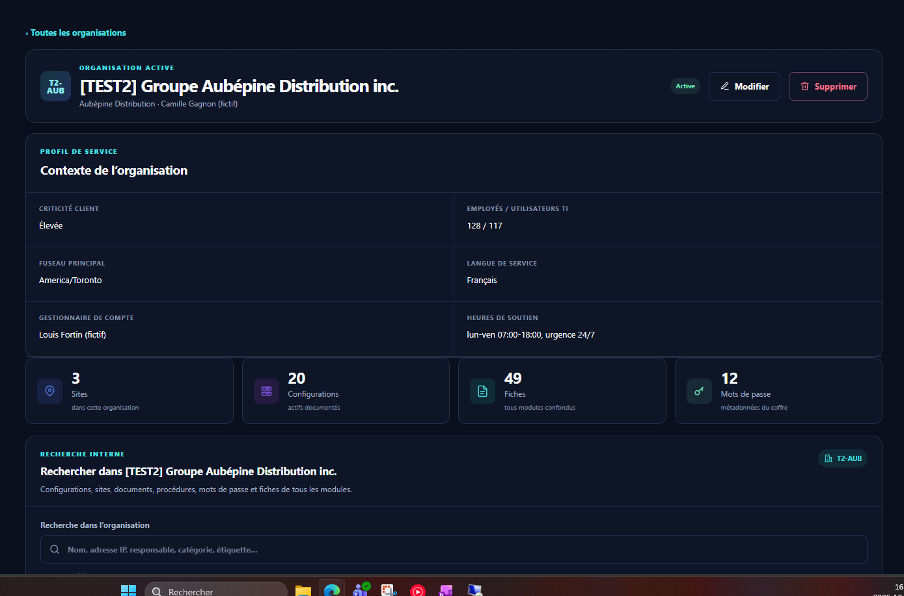
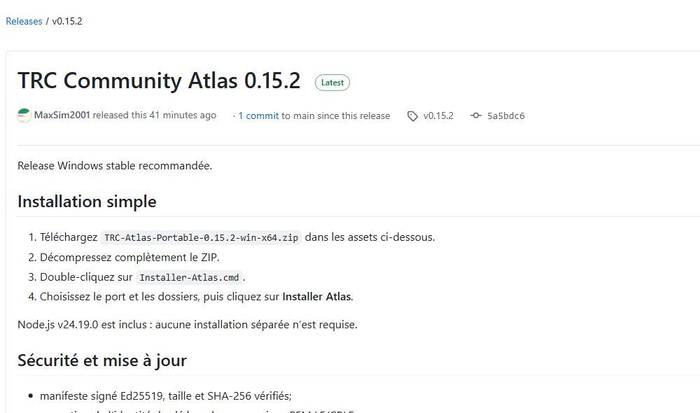
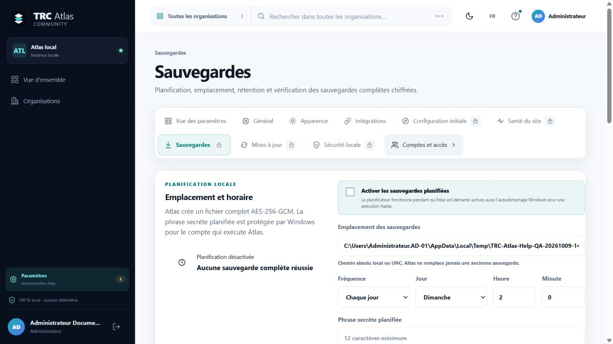
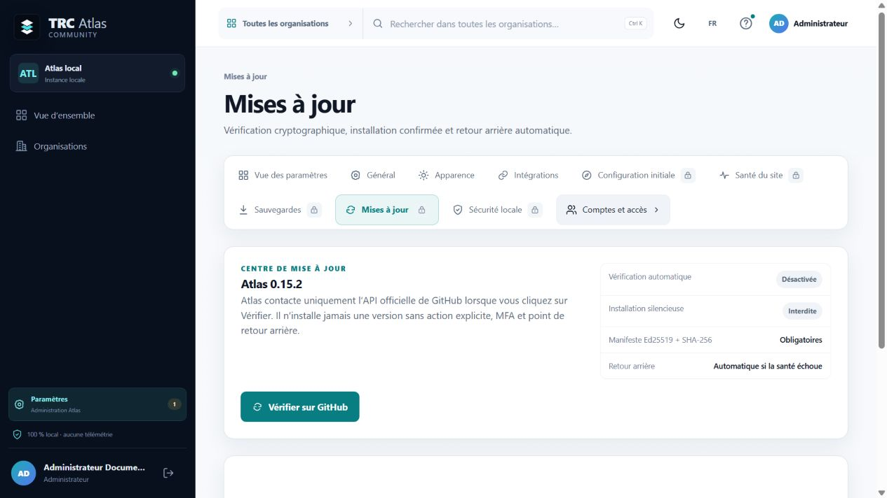

# Atlas documentation

This directory contains the public documentation for TRC Community Atlas.
Start with the guides below rather than the historical QA records.

## New users

1. Read the [project overview](../README.md).
2. Follow the [Windows installation guide](INSTALLATION_WINDOWS.md).
3. Complete the first-administrator setup and save the MFA recovery codes.
4. Create the first encrypted backup before entering production data.

## Using Atlas

- [Product showcase](SHOWCASE.md) — real screenshots using fictional data and
  a compact tour of the main Atlas capabilities.
- [User guide](USER_GUIDE.md) — organizations, modules, records, documents,
  relationships, search, archive, and mobile use.
- [Security and access](SECURITY_AND_ACCESS.md) — accounts, roles, MFA,
  sessions, vault access, proxies, and recovery.
- [Operations guide](OPERATIONS_GUIDE.md) — health checks, backups, updates,
  logs, recovery, and routine administration.

## Installation and distribution

- [Windows installation](INSTALLATION_WINDOWS.md)
- [GitHub distribution readiness](GITHUB_READINESS.md)
- [Release and update design](PLAN_GITHUB_INSTALL_UPDATE.md)
- [Windows release signing](CODE_SIGNING.md)
- [Release notes](RELEASE_NOTES.md)

## Development and project policy

- [Architecture](ARCHITECTURE.md)
- [Licensing guide](LICENSING.md)
- [Contributor ownership](CONTRIBUTOR_OWNERSHIP.md)
- [Contributing](../CONTRIBUTING.md)
- [IT Glue functional coverage](ITGLUE_FUNCTIONAL_COVERAGE.md)

## Screenshots

The screenshots below are real Atlas and GitHub screens. Some show the French
interface; Atlas can be switched to English under **Settings > General**.

### Organization workspace

### Official GitHub Release

### Backup management

### Signed updates

## Historical QA records

Files whose names begin with `QA_` are retained as dated audit evidence. Some
older reports are in French because they record the language and state of the
tested build at that time. They are not the current installation or user
documentation. Do not copy environment-specific addresses, paths, or test data
from an old report into a new deployment.

